# Company Sustainability Data Model

**Purpose:** Answer the question *"is this supplier a good sustainability partner?"* for any company in a user's supply chain, with data normalized to GHG Protocol standards so it remains comparable across sources and companies.

## ER Diagram

```mermaid
erDiagram
    COMPANY ||--o{ COMPANY : "parent_of"
    COMPANY ||--o{ EMISSIONS_DISCLOSURE : "reports"
    COMPANY ||--o{ EMISSIONS_LINE_ITEM : "reports"
    COMPANY ||--o{ COMPANY_CATEGORY_MAPPING : "defines"
    COMPANY ||--o{ EMISSIONS_TARGET : "commits_to"
    COMPANY ||--o{ DECARBONIZATION_PROGRAM : "executes"
    COMPANY ||--o{ SUSTAINABILITY_CERTIFICATION : "holds"

    EMISSIONS_DISCLOSURE ||--o{ EMISSIONS_LINE_ITEM : "contains"
    EMISSIONS_LINE_ITEM }o--|| COMPANY_CATEGORY_MAPPING : "normalized_via"
    EMISSIONS_LINE_ITEM }o--o{ EMISSIONS_CATEGORY_TAG : "tagged_with"
    COMPANY_CATEGORY_MAPPING }o--|| GHG_PROTOCOL_CATEGORY : "maps_to"

    EMISSIONS_TARGET ||--o{ TARGET_PROGRESS_SNAPSHOT : "tracked_by"

    DECARBONIZATION_PROGRAM }o--o| GHG_PROTOCOL_CATEGORY : "targets"

    DATA_PROVENANCE }o--|| COMPANY : "describes_record_of"
    DATA_PROVENANCE }o--|| SOURCE_DOCUMENT : "extracted_from"

    SOURCE_DOCUMENT }o--|| COMPANY : "describes"
    EMISSIONS_DISCLOSURE }o--|| SOURCE_DOCUMENT : "sourced_from"

    COMPANY {
        uuid company_id PK
        string canonical_name
        string legal_name
        string_array aliases
        uuid parent_company_id FK
        string ticker
        string lei
        string hq_country
        string industry_naics
        bool is_public
        int employee_count
        decimal annual_revenue_eur
        int revenue_year
        bool exec_comp_tied_to_climate
        decimal exec_comp_pct
        bool board_oversight
        string board_committee_name
        bool has_transition_plan
        bool has_forest_policy
        bool has_water_policy
        bool has_human_rights_policy
        enum benefit_corp_status
        date last_policy_update
        timestamp governance_last_verified_at
        timestamp created_at
        timestamp updated_at
    }

    EMISSIONS_DISCLOSURE {
        uuid disclosure_id PK
        uuid company_id FK
        uuid source_document_id FK
        int reporting_year
        decimal scope_1_tco2e
        decimal scope_2_location_tco2e
        decimal scope_2_market_tco2e
        decimal scope_3_total_tco2e
        enum methodology
        enum verification_status
        string verifier_name
        enum source_authority
        text boundary_definition
        text boundary_notes
        bool restated_from_prior
        int page_number
        string section_reference
        date published_on
        timestamp last_verified_at
        bool is_withdrawn
        timestamp created_at
        timestamp updated_at
    }

    EMISSIONS_LINE_ITEM {
        uuid line_item_id PK
        uuid disclosure_id FK
        uuid company_id FK
        int reporting_year
        string native_category
        decimal tco2e
        enum data_quality_tier
        bool is_excluded_from_target
        string exclusion_reason
        text notes
        bool is_withdrawn
        timestamp created_at
        timestamp updated_at
    }

    COMPANY_CATEGORY_MAPPING {
        uuid mapping_id PK
        uuid company_id FK
        string native_category
        string ghg_code FK
        decimal allocation_pct
        int effective_from_year
        int effective_to_year
        text rationale
        timestamp created_at
        timestamp updated_at
    }

    GHG_PROTOCOL_CATEGORY {
        string ghg_code PK
        int scope
        int category_number
        string name
        string typical_activities
        string standard_version
        timestamp created_at
        timestamp updated_at
    }

    EMISSIONS_CATEGORY_TAG {
        string tag_code PK
        string name
        string description
        timestamp created_at
        timestamp updated_at
    }

    EMISSIONS_TARGET {
        uuid target_id PK
        uuid company_id FK
        enum target_type
        enum sbti_status
        date sbti_validation_date
        int baseline_year
        int target_year
        decimal baseline_tco2e
        decimal target_tco2e
        decimal reduction_pct
        string_array scope_coverage
        bool is_absolute
        enum sub_category
        text target_language
        date set_on
        timestamp last_verified_at
        bool is_withdrawn
        timestamp created_at
        timestamp updated_at
    }

    TARGET_PROGRESS_SNAPSHOT {
        uuid snapshot_id PK
        uuid target_id FK
        int reporting_year
        decimal current_tco2e
        decimal pct_reduction_vs_baseline
        decimal pct_of_target_achieved
        bool on_track
        text attribution_notes
        bool is_withdrawn
        timestamp created_at
        timestamp updated_at
    }

    DECARBONIZATION_PROGRAM {
        uuid program_id PK
        uuid company_id FK
        string program_name
        enum lever_type
        decimal estimated_reduction_tco2e
        int target_year
        string ghg_code_targeted FK
        text description
        date started_on
        int last_reaffirmed_in_year
        enum status
        bool is_withdrawn
        timestamp created_at
        timestamp updated_at
    }

    SUSTAINABILITY_CERTIFICATION {
        uuid certification_id PK
        uuid company_id FK
        enum scheme
        string score_or_status
        int year
        date expires_on
        string scope_of_coverage
        string source_url
        timestamp last_verified_at
        bool is_withdrawn
        timestamp created_at
        timestamp updated_at
    }

    DATA_PROVENANCE {
        uuid provenance_id PK
        uuid record_id
        string record_table
        uuid source_document_id FK
        int page_number
        string section_reference
        date extraction_date
        enum extraction_method
        string extractor_version
        jsonb raw_extraction_payload
        decimal confidence
        bool human_verified
        timestamp source_last_checked_at
        timestamp created_at
        timestamp updated_at
    }

    SOURCE_DOCUMENT {
        uuid source_document_id PK
        uuid company_id FK
        string content_hash
        string storage_bucket
        string storage_path
        string original_url
        enum source_type
        date publication_date
        timestamp retrieved_at
        bigint file_size_bytes
        string mime_type
        int page_count
        bool is_primary
        timestamp created_at
        timestamp updated_at
    }
```



## Table reference

Every table and field is defined below. Shared system fields (`created_at`, `updated_at`) are present on every table and serve the same purpose everywhere — defined once here rather than repeated per table:

- **`created_at`** — `timestamp`. When the row was inserted into our database. Never changes after insert.
- **`updated_at`** — `timestamp`. When the row was last modified. Auto-updated on write.

Soft-delete fields (`is_withdrawn`) are used on tables that hold observations we might later retract. Retracted rows are excluded from reconciliation queries but preserved for audit.

---

### COMPANY

**Purpose:** One row per legal entity we track. The canonical anchor everything else points to. Self-referential via `parent_company_id` to model subsidiary relationships (e.g., ~230 Danone subsidiaries point to the Danone parent row). Governance signals live here as columns because they have a fixed schema and a 1:1 relationship with the company.

| Field | Type | Description |
|---|---|---|
| `company_id` | uuid PK | Internal stable identifier. Used by all FK references. |
| `canonical_name` | string | Primary display name (e.g., "Danone S.A."). What we show in the UI by default. |
| `legal_name` | string | Full legal entity name as registered. May match or differ from canonical. |
| `aliases` | string[] | Known alternate names, brand names, and common misspellings (e.g., "Danone", "Groupe Danone"). Fuels entity-resolution matching. |
| `parent_company_id` | uuid FK | Self-reference to the parent `COMPANY`. NULL if top-level. |
| `ticker` | string | Public stock ticker if applicable (e.g., "BN.PA"). NULL for private companies. |
| `lei` | string | Legal Entity Identifier — global 20-character ID issued under ISO 17442. Useful for disambiguation. |
| `hq_country` | string | ISO 3166-1 alpha-2 country code of headquarters. |
| `industry_naics` | string | NAICS industry code. Used for industry-average fallbacks when disclosure is sparse. |
| `is_public` | bool | True if publicly listed. Private companies (e.g., Cargill) typically have thinner disclosure. |
| `employee_count` | int | Headcount. Approximate, updated annually from latest disclosure. |
| `annual_revenue_eur` | decimal | Latest reported revenue, normalized to EUR. Needed for intensity metrics. |
| `revenue_year` | int | Fiscal year the `annual_revenue_eur` figure refers to. |
| `exec_comp_tied_to_climate` | bool | Whether executive compensation is linked to climate/sustainability KPIs. A governance signal. |
| `exec_comp_pct` | decimal | Percentage of executive LTI/bonus tied to climate KPIs (e.g., 30 for Danone). NULL if not disclosed. |
| `board_oversight` | bool | Whether a board-level committee has climate oversight. |
| `board_committee_name` | string | Name of the responsible committee (e.g., "CSR & Ethics Committee"). |
| `has_transition_plan` | bool | Whether the company has published a formal climate transition plan. |
| `has_forest_policy` | bool | Whether a published forest/deforestation policy exists. |
| `has_water_policy` | bool | Whether a published water stewardship policy exists. |
| `has_human_rights_policy` | bool | Whether a published human-rights policy exists. |
| `benefit_corp_status` | enum | Status under benefit-corp frameworks: `none`, `b_corp_certified`, `societe_a_mission`, `delaware_pbc`, `other`. |
| `last_policy_update` | date | Most recent date any of the above policies was last revised. |
| `governance_last_verified_at` | timestamp | When we last confirmed the governance fields are still accurate. |

---

### EMISSIONS_DISCLOSURE

**Purpose:** Top-line emissions summary for one company, one reporting year, from one source document. Multiple rows per (company, year) are expected — each source's view is its own observation. Reconciliation happens at query time.

| Field | Type | Description |
|---|---|---|
| `disclosure_id` | uuid PK | Internal identifier. |
| `company_id` | uuid FK | The company this disclosure is about. |
| `source_document_id` | uuid FK | The source document this disclosure was extracted from. Direct FK (not polymorphic) because this lookup is the hot path. |
| `reporting_year` | int | Fiscal year the emissions data describes (e.g., 2023), not the publication year. |
| `scope_1_tco2e` | decimal | Direct emissions (owned fuel combustion, fleet), in metric tons CO2e. |
| `scope_2_location_tco2e` | decimal | Scope 2 under the location-based method (grid-average emission factors). |
| `scope_2_market_tco2e` | decimal | Scope 2 under the market-based method (contractual instruments like RECs/PPAs). Both are stored because GHG Protocol requires dual reporting. |
| `scope_3_total_tco2e` | decimal | Total value-chain emissions. Detail lives in `EMISSIONS_LINE_ITEM` rows. |
| `methodology` | enum | Which accounting standard was used: `ghg_protocol_corporate`, `iso_14064`, `tcfd_aligned`, `other`. |
| `verification_status` | enum | `none`, `limited_assurance`, `reasonable_assurance`. ISAE 3000 / ISO 14064-3 distinctions. |
| `verifier_name` | string | Third-party assurance provider (e.g., "PwC", "Bureau Veritas"). NULL if unverified. |
| `source_authority` | enum | Ranks the source for reconciliation: `self_reported_verified`, `self_reported`, `regulatory_filing`, `third_party_estimated`. Drives the coalesce priority. |
| `boundary_definition` | text | Human-readable description of the organizational boundary (e.g., "Operational control, excluding Horizon Organic post-divestiture"). |
| `boundary_notes` | text | Free-text notes on anything unusual about scope, exclusions, or consolidation. |
| `restated_from_prior` | bool | True when this row restates a previously-published value (e.g., after a methodology change). |
| `page_number` | int | Page number within the source document where the figures appear. |
| `section_reference` | string | Section or table identifier (e.g., "Table 4.2") for precise provenance. |
| `published_on` | date | Date the source document was published. Tie-breaker within the same `source_authority` tier. |
| `last_verified_at` | timestamp | When we last confirmed this disclosure is still the company's current published view. |
| `is_withdrawn` | bool | Soft-delete flag. Excluded from reconciliation when true. |

---

### EMISSIONS_LINE_ITEM

**Purpose:** Category-level detail beneath a disclosure, in the company's own native taxonomy. One row per native category per disclosure. Joined to `COMPANY_CATEGORY_MAPPING` for normalization to GHG Protocol codes at query time.

| Field | Type | Description |
|---|---|---|
| `line_item_id` | uuid PK | Internal identifier. |
| `disclosure_id` | uuid FK | The parent disclosure this line item belongs to. |
| `company_id` | uuid FK | Denormalized from the disclosure for query performance (lets us filter line items by company without joining). |
| `reporting_year` | int | Denormalized from the disclosure for the same reason. |
| `native_category` | string | The category name as the company reports it (e.g., "Milk", "Logistics", "Co-manufacturing"). |
| `tco2e` | decimal | The emission value in metric tons CO2e. |
| `data_quality_tier` | enum | `supplier_specific`, `hybrid`, `industry_average`, `spend_based`. The 2027 GHG Protocol revision makes this mandatory. |
| `is_excluded_from_target` | bool | True if this line item is outside the company's target boundary (e.g., biogenic flows excluded from SBTi target). |
| `exclusion_reason` | string | Short machine-parseable reason when `is_excluded_from_target` is true. |
| `notes` | text | Free-text notes (methodology caveats, data gaps, etc.). |
| `is_withdrawn` | bool | Soft-delete flag. |

---

### COMPANY_CATEGORY_MAPPING

**Purpose:** Translation rule from a company's native category name to one or more GHG Protocol codes. This is the normalization layer. Company-specific because the same native term (e.g., "Logistics") can map differently at different companies. Supports many-to-many mapping via `allocation_pct`.

| Field | Type | Description |
|---|---|---|
| `mapping_id` | uuid PK | Internal identifier. |
| `company_id` | uuid FK | The company this mapping applies to. |
| `native_category` | string | The company's native term. Matches `EMISSIONS_LINE_ITEM.native_category`. |
| `ghg_code` | string FK | The GHG Protocol category code the native term maps to. |
| `allocation_pct` | decimal | Fraction (0.0 to 1.0) of the native value allocated to this GHG code. Sums to 1.0 across all rows for a given `(company_id, native_category)`. Example: Danone's "Logistics" splits 0.5 to Category 4 and 0.5 to Category 9. |
| `effective_from_year` | int | First reporting year this mapping applies to. Lets us version mappings if the company changes its taxonomy. |
| `effective_to_year` | int | Last reporting year this mapping applies to. NULL means "still current". |
| `rationale` | text | Why this mapping was chosen. Important for auditability when analysts need to explain the normalization. |

---

### GHG_PROTOCOL_CATEGORY

**Purpose:** Reference table of the standard GHG Protocol categories. Mostly read-only. New rows are added as the standard evolves (e.g., Category 16 "facilitated emissions" in the 2027 revision).

| Field | Type | Description |
|---|---|---|
| `ghg_code` | string PK | Short code we use as FK (e.g., `s1`, `s2_loc`, `s2_mkt`, `s3_1` through `s3_15`). |
| `scope` | int | 1, 2, or 3. |
| `category_number` | int | Scope 3 category number (1–15). NULL for Scope 1 and Scope 2. |
| `name` | string | Official name (e.g., "Purchased Goods & Services"). |
| `typical_activities` | string | Brief description of what belongs in this category. |
| `standard_version` | string | Which edition of the GHG Protocol defines this entry (e.g., "2011_corporate_value_chain"). Supports side-by-side coexistence during a standard revision. |

---

### EMISSIONS_CATEGORY_TAG

**Purpose:** Reference table of allowed tag values that can be attached to line items. Orthogonal to GHG categories — tags like FLAG cut across multiple Scope 3 categories. Mostly read-only; we add new tags as the vocabulary expands.

| Field | Type | Description |
|---|---|---|
| `tag_code` | string PK | Short identifier (e.g., `flag`, `biogenic`, `removals`, `outside_reporting_boundary`). |
| `name` | string | Human-readable label. |
| `description` | string | What the tag means and when to apply it. |

---

### EMISSIONS_TARGET

**Purpose:** A commitment to reduce emissions. Captures SBTi-validated targets, net-zero commitments, sub-targets (e.g., methane-specific), and any other quantified reduction pledge. Multiple targets per company are the norm.

| Field | Type | Description |
|---|---|---|
| `target_id` | uuid PK | Internal identifier. |
| `company_id` | uuid FK | The company making the commitment. |
| `target_type` | enum | `near_term`, `long_term`, `net_zero`, `interim`, `sub_target`. |
| `sbti_status` | enum | `not_submitted`, `committed`, `targets_set`, `validated`, `removed`. Tracks the SBTi pipeline state. |
| `sbti_validation_date` | date | Date SBTi validated the target, if applicable. |
| `baseline_year` | int | Year the target is measured against (e.g., 2020). |
| `target_year` | int | Year by which the target must be met (e.g., 2030). |
| `baseline_tco2e` | decimal | Absolute emissions in the baseline year, in tCO2e. The anchor for progress calculations. |
| `target_tco2e` | decimal | Absolute target emissions in `target_year`. Derived from baseline and reduction if the company only publishes a percentage. |
| `reduction_pct` | decimal | Percentage reduction relative to baseline (e.g., 34.7 for Danone's near-term target). |
| `scope_coverage` | string[] | Which scopes the target covers (e.g., `["scope_1", "scope_2_market", "scope_3"]`). |
| `is_absolute` | bool | True for absolute targets, false for intensity-based targets. |
| `sub_category` | enum | If this is a sub-target, what it covers: `methane`, `flag`, `energy`, `other`, or `none`. |
| `target_language` | text | Verbatim target statement as the company wrote it. Preserves nuance that structured fields lose. |
| `set_on` | date | Date the target was formally set or announced. |
| `last_verified_at` | timestamp | When we last confirmed the target is still active and unchanged. |
| `is_withdrawn` | bool | Soft-delete flag. Companies do occasionally retract targets. |

---

### TARGET_PROGRESS_SNAPSHOT

**Purpose:** Year-over-year performance against a target. One row per (target, reporting_year). Computed progress rather than a raw disclosure.

| Field | Type | Description |
|---|---|---|
| `snapshot_id` | uuid PK | Internal identifier. |
| `target_id` | uuid FK | The target being tracked. |
| `reporting_year` | int | The year this snapshot describes. |
| `current_tco2e` | decimal | Emissions in the reporting year under the target's scope coverage. |
| `pct_reduction_vs_baseline` | decimal | `(baseline - current) / baseline * 100`. Negative if emissions grew. |
| `pct_of_target_achieved` | decimal | Progress toward the target as a percentage (e.g., 40% means we've closed 40% of the baseline-to-target gap). |
| `on_track` | bool | Whether the company is on a linear-or-better trajectory to meet the target by `target_year`. |
| `attribution_notes` | text | Explanation of one-offs affecting the figure (e.g., "Includes divestiture of Horizon Organic"). Critical for interpreting apparent progress. |
| `is_withdrawn` | bool | Soft-delete flag. |

---

### DECARBONIZATION_PROGRAM

**Purpose:** A named initiative or lever the company is using to hit its targets. Examples from Danone: Re-Fuel, Milk program, Packaging redesign. Distinct from `EMISSIONS_TARGET` — targets are destinations, programs are the vehicles.

| Field | Type | Description |
|---|---|---|
| `program_id` | uuid PK | Internal identifier. |
| `company_id` | uuid FK | The company running this program. |
| `program_name` | string | Company's name for the program (e.g., "Re-Fuel"). |
| `lever_type` | enum | What kind of lever this is: `renewable_energy`, `fleet_electrification`, `supplier_engagement`, `product_reformulation`, `regenerative_agriculture`, `packaging_redesign`, `logistics_optimization`, `process_improvement`, `other`. |
| `estimated_reduction_tco2e` | decimal | Expected abatement by `target_year`, as disclosed by the company. |
| `target_year` | int | Year by which the program's reduction is expected. |
| `ghg_code_targeted` | string FK | Which GHG Protocol category the program primarily addresses. NULL if cross-cutting. |
| `description` | text | Free-text description of what the program does. |
| `started_on` | date | Program launch date. |
| `last_reaffirmed_in_year` | int | Most recent year the company mentioned this program in public disclosure. Used to detect abandonment. |
| `status` | enum | `active`, `completed`, `paused`, `abandoned`. |
| `is_withdrawn` | bool | Soft-delete flag. |

---

### SUSTAINABILITY_CERTIFICATION

**Purpose:** Third-party validations and scores — CDP scores, SBTi validation, B Corp, RE100, RSPO, etc. Variable cardinality (a company can have 0 or 15+), heterogeneous schemas across schemes, and different refresh cadences is why this is separate from `COMPANY` rather than folded in as columns.

| Field | Type | Description |
|---|---|---|
| `certification_id` | uuid PK | Internal identifier. |
| `company_id` | uuid FK | The company holding the certification. |
| `scheme` | enum | Which body issued the cert: `cdp_climate`, `cdp_water`, `cdp_forests`, `sbti`, `b_corp`, `re100`, `ep100`, `ev100`, `rspo`, `access_to_nutrition`, `other`. |
| `score_or_status` | string | The actual result — a letter grade (e.g., "A-"), a status (e.g., "Validated"), or a score (e.g., "92.8%"). Stored as string because schemas vary by scheme. |
| `year` | int | Year the certification was awarded or most recently refreshed. |
| `expires_on` | date | Expiration date if the scheme has one (e.g., B Corp recerts every 3 years). NULL for evergreen schemes. |
| `scope_of_coverage` | string | What portion of the business is covered (e.g., "92.8% of sales" for B Corp partial coverage). |
| `source_url` | string | Direct URL to the cert page (e.g., CDP disclosure page, B Corp profile). |
| `last_verified_at` | timestamp | When we last confirmed the cert is still valid. |
| `is_withdrawn` | bool | Soft-delete flag. Certs do get revoked. |

---

### SOURCE_DOCUMENT

**Purpose:** Metadata record for every source file archived in blob storage (Supabase Storage). One row per unique file, deduped by `content_hash`. The bridge between blob storage (raw bytes) and the relational model (structured data extracted from those bytes).

| Field | Type | Description |
|---|---|---|
| `source_document_id` | uuid PK | Internal identifier. Used as FK from `EMISSIONS_DISCLOSURE` and `DATA_PROVENANCE`. |
| `company_id` | uuid FK | The company this document is about. |
| `content_hash` | string UNIQUE | SHA-256 of the file bytes. UNIQUE constraint prevents storing the same PDF twice. Also acts as an integrity check. |
| `storage_bucket` | string | Supabase Storage bucket name (e.g., `sustainability-sources`). |
| `storage_path` | string | Full path within the bucket (e.g., `{company_id}/annual_report/2024/{content_hash}.pdf`). Stable — does not rot. |
| `original_url` | string | The public URL we originally fetched the file from. May 404 later; kept for attribution. |
| `source_type` | enum | What kind of document: `annual_report`, `integrated_report`, `cdp_response`, `transition_plan`, `non_financial_statement`, `sbti_commitment`, `subsidiary_list`, `impact_report`, `other`. |
| `publication_date` | date | When the source document was published by its author. |
| `retrieved_at` | timestamp | When we downloaded the file into our storage. |
| `file_size_bytes` | bigint | File size. Used for storage-cost accounting and integrity checks. |
| `mime_type` | string | e.g., `application/pdf`, `text/html`. |
| `page_count` | int | For PDFs, total page count. Helpful for page-range citations. |
| `is_primary` | bool | True for the canonical version of this (company, source_type, year). If a company republishes with corrections, the new version becomes `is_primary = true` and the old one flips to false but remains for audit. |

---

### DATA_PROVENANCE

**Purpose:** Provenance overlay. Polymorphic pointer (`record_table` + `record_id`) so any row in any table can be traced back to its source document, extraction method, and confidence score. Also holds the raw extraction payload for reprocessing.

| Field | Type | Description |
|---|---|---|
| `provenance_id` | uuid PK | Internal identifier. |
| `record_id` | uuid | The ID of the row this provenance describes. Combined with `record_table` forms a polymorphic pointer. |
| `record_table` | string | The table the `record_id` refers to (e.g., `emissions_line_item`, `emissions_target`, `decarbonization_program`). |
| `source_document_id` | uuid FK | The source document the record was extracted from. |
| `page_number` | int | Page number within the source document where the claim appears. NULL if unknown. |
| `section_reference` | string | Section or table identifier within the document (e.g., "Table 4.2"). NULL if unknown. |
| `extraction_date` | date | When we extracted this value from the source. Drives "what did we know as of X?" temporal reconstruction. |
| `extraction_method` | enum | How we got it: `llm_structured`, `llm_freeform`, `pdf_table_parser`, `api_ingest`, `manual`, `human_reviewed`. |
| `extractor_version` | string | Version tag of the extractor used (e.g., `extractor-v2.3.1`). Lets us re-run old data with new extractors. |
| `raw_extraction_payload` | jsonb | The raw output of the extractor before normalization. Enables reprocessing without re-fetching the source and debugging drift in non-deterministic LLM extraction. |
| `confidence` | decimal | Extractor's confidence score (0.0 to 1.0). Used to route low-confidence cases to human review. |
| `human_verified` | bool | True if a human has reviewed and confirmed this extraction. |
| `source_last_checked_at` | timestamp | When we last re-visited `original_url` to check whether the source document has changed or disappeared. |

---

## Logical zones

**Identity zone** — `COMPANY` on its own, with a self-referential relationship for parent/subsidiary. Governance signals (exec comp, board oversight, published policies) are folded in as columns since they're 1:1 with the company.

**Emissions zone** — Four pieces working together:
- `EMISSIONS_DISCLOSURE` holds the top-line summary per company-year per source, with methodology and verification metadata
- `EMISSIONS_LINE_ITEM` holds category-level detail in the company's native taxonomy, with tags attached directly
- `COMPANY_CATEGORY_MAPPING` is the translation rule from a company's native categories to GHG Protocol codes
- `GHG_PROTOCOL_CATEGORY` is the reference table of standard categories
- `EMISSIONS_CATEGORY_TAG` is the reference table of allowed tag values (FLAG, biogenic, removals, etc.)

**Commitment zone** — `EMISSIONS_TARGET` captures commitments, `TARGET_PROGRESS_SNAPSHOT` tracks year-over-year performance against each target, and `DECARBONIZATION_PROGRAM` captures named decarbonization levers.

**Validation zone** — `SUSTAINABILITY_CERTIFICATION` holds third-party validations as separate rows because they have heterogeneous schemas and refresh at different cadences.

**Source zone** — `SOURCE_DOCUMENT` is the metadata record for every PDF, CDP response, or other file we've archived in blob storage. One row per unique file (deduped by content hash). `EMISSIONS_DISCLOSURE` has a direct FK because it's the hot path for source lookups; all other tables reach their source documents through `DATA_PROVENANCE`.

**Provenance overlay** — `DATA_PROVENANCE` uses polymorphic pointers so any row in any table can have its source tracked, including page-level detail and the raw extraction payload for reprocessing.

## Reconciliation: multiple observations, coalesce at query time

### The core pattern

The same company-year can have multiple observations from different sources. Each becomes its own row in `EMISSIONS_DISCLOSURE` (or `EMISSIONS_TARGET`, etc.), with its own `DATA_PROVENANCE` record pointing to the source. The model does not force a single "true" value — it stores everything and reconciles at query time.

Reconciliation is a prioritized coalesce over observations:

```sql
SELECT scope_3_total_tco2e
FROM emissions_disclosure
WHERE company_id = 'danone'
  AND reporting_year = 2020
  AND NOT is_withdrawn
ORDER BY 
  CASE source_authority
    WHEN 'self_reported_verified' THEN 1
    WHEN 'self_reported' THEN 2
    WHEN 'regulatory_filing' THEN 3
    WHEN 'third_party_estimated' THEN 4
  END,
  published_on DESC
LIMIT 1
```

The priority order is explicit, tunable, and parameterizable per customer. Wrap the query in a view or helper function (e.g., `get_canonical_metric(company, year, metric)`) so all consumers use consistent logic by default.

### source_authority values

Suggested enum:
- `self_reported_verified` — company published the number AND third-party verified it (e.g., via ISAE 3000)
- `self_reported` — company published the number without independent verification
- `regulatory_filing` — the number comes from mandatory disclosure (SEC, CSRD, California SB 253)
- `third_party_estimated` — a third party (CDP, Bloomberg, MSCI) estimated the number where the company didn't disclose

### Handling the four reconciliation scenarios

**Same fact, matching values from multiple sources**: Multiple disclosure rows with the same value. Coalesce returns one; users can see all.

**Restatement across reports**: Two rows with different `published_on` dates. Coalesce orders by publication date DESC within the same authority tier — the newer value wins. Old value remains queryable.

**Same name, different boundaries**: Two rows with different `boundary_definition` values. If the user filters by boundary, only matching rows participate. Both values coexist as legitimately different metrics.

**Self-reported vs. third-party estimate**: Two rows with different `source_authority`. Coalesce priority picks self-reported by default. Users can override priority rules to see third-party view.

### Withdrawals, not deletes

If an extraction is wrong, set `is_withdrawn = true`. This removes the row from coalesce results without destroying audit history. Recovery is just flipping the flag back.

## Source document storage

Raw source files (PDFs, CDP responses, subsidiary lists) live in blob storage — specifically Supabase Storage — not in Postgres. The `SOURCE_DOCUMENT` table is the metadata bridge between blob storage and the relational model.

### Path convention

Files are stored at deterministic paths in a single bucket:

```
sustainability-sources/
  {company_id}/
    {source_type}/
      {year}/
        {content_hash}.pdf
```

Example: `sustainability-sources/a3f.../annual_report/2024/sha256-b2c1....pdf`

### Why `content_hash` matters

The SHA-256 hash of the file bytes is a UNIQUE constraint on `SOURCE_DOCUMENT`. This gives three things:

1. **Deduplication** — the same PDF uploaded twice collapses into one row
2. **Integrity** — we can verify the file hasn't been corrupted or swapped
3. **Stable identity** — the file's identity is intrinsic to its bytes, not assigned by us

The primary key stays as a UUID (`source_document_id`) so metadata can be re-associated without touching the content hash.

### Why `original_url` and `storage_path` are both stored

Public URLs rot. Companies reorganize their sustainability sites and old links 404. `storage_path` points to our archived copy (stable); `original_url` preserves the attribution trail (where we found it, even if that URL is now dead).

### The EMISSIONS_DISCLOSURE direct FK

Every `EMISSIONS_DISCLOSURE` row comes from exactly one source document — that relationship is genuinely 1:1. The "many documents reporting the same fact" case is handled by having multiple disclosure rows (one per source), not by one disclosure pointing at many documents.

Because source lookup from a disclosure is the hot path ("show me the PDF behind this number"), `EMISSIONS_DISCLOSURE` has a direct FK to `SOURCE_DOCUMENT` rather than routing through `DATA_PROVENANCE`. This saves a join on the most common provenance query.

Other tables (`EMISSIONS_LINE_ITEM`, `EMISSIONS_TARGET`, `DECARBONIZATION_PROGRAM`, `SUSTAINABILITY_CERTIFICATION`) reach their source documents through `DATA_PROVENANCE` — the polymorphic pattern is fine there because those lookups are less frequent.

### Page-level provenance

Both `EMISSIONS_DISCLOSURE` and `DATA_PROVENANCE` carry `page_number` and `section_reference`. When a customer disputes a number, "extracted from Danone's 2024 AIR, page 47, Table 4.2" is vastly more useful than "extracted from Danone's 2024 AIR." It's also essential for the human review loop.

### Raw extraction payloads on DATA_PROVENANCE

`DATA_PROVENANCE.raw_extraction_payload` is a JSONB blob containing whatever the extractor produced before normalization, along with `extractor_version`. This enables three things:

1. **Reprocessing** — when extraction rules improve, re-run against the stored payload instead of re-fetching and re-parsing the PDF
2. **Auditability** — trace a normalized value back through the extraction, not just to the source document
3. **Debug drift** — LLM extraction is non-deterministic; keeping raw output lets us diagnose when results change

This is deliberately structured data (JSONB in Postgres), not blob storage, because we query over it.

### What about versioning?

If a company republishes a report with corrections, the new version gets its own `SOURCE_DOCUMENT` row (different content hash). The `is_primary` flag marks which version is canonical for new extractions; older versions remain for provenance and reprocessing.


Three kinds of time information, serving different purposes:

| Timestamp type | Purpose | Present on |
|---|---|---|
| `created_at` / `updated_at` | System bookkeeping — when did the row appear in our DB? | Every table |
| Source-event timing (`published_on`, `set_on`, `started_on`, `expires_on`, `publication_date`) | When did the real-world event happen? | Disclosure, Target, Program, Certification, Source Document |
| `last_verified_at` | Freshness — when did we last confirm this is still true? | Disclosure, Target, Certification, Company governance |
| `retrieved_at`, `extraction_date`, `source_last_checked_at` | Provenance trail — when was the source downloaded, extracted, and last re-checked? | SOURCE_DOCUMENT, DATA_PROVENANCE |

Temporal reconstruction ("what did we know as of March 2025?") works through `DATA_PROVENANCE.extraction_date` combined with `is_withdrawn = false` as of that date. No supersession chain needed.

## Worked example: Danone with two observations

Scenario: The CDP 2024 response shows Danone's 2020 Scope 3 as 20.9 Mt. The 2025 AIR restates it as 19.5 Mt after methodology updates.

**EMISSIONS_DISCLOSURE** rows for Danone 2020:

| disclosure_id | published_on | source_authority | scope_3_total | is_withdrawn |
|---|---|---|---|---|
| d1 | 2024-07-01 | self_reported_verified | 20,900,000 | false |
| d2 | 2025-06-01 | self_reported_verified | 19,500,000 | false |

Both have `DATA_PROVENANCE` rows pointing at their respective source documents.

Coalesce query for "current canonical value" returns d2 (newer within same authority tier).
Query "all observations" returns both.
Query "what did we have as of April 2025?" filters by `DATA_PROVENANCE.extraction_date <= 2025-04-01` and returns d1.

## Other worked example details: Danone

- **COMPANY**: canonical_name = "Danone S.A.", hq_country = "FR", is_public = true, annual_revenue_eur = 27,400,000,000, exec_comp_tied_to_climate = true, exec_comp_pct = 30, board_oversight = true, has_transition_plan = true, benefit_corp_status = "societe_a_mission"
- **COMPANY** (subsidiaries): ~230 rows with parent_company_id pointing at Danone (Alpro, Nutricia, Silk, evian, etc.)
- **EMISSIONS_LINE_ITEM** (2020 disclosure): 8 rows — Milk (7.9M, tagged FLAG), Dairy Ingredients (3.8M, tagged FLAG), Non-dairy (2.1M, tagged FLAG), Packaging (3.2M, no tags), Logistics (1.9M, no tags), Co-manufacturing (1.6M, no tags), Other (0.4M, no tags), Energy & Industrial (1.0M, no tags)
- **COMPANY_CATEGORY_MAPPING**: 11 rows mapping those 8 native categories to GHG codes 1, 4, 9, 5, 3, s1, s2_mkt — some one-to-one, some one-to-many (Logistics splits 50/50 across Cat 4 and Cat 9)
- **EMISSIONS_TARGET**: 3 rows — near-term SBTi-validated 1.5°C (-34.7% by 2030), net-zero submitted, methane sub-target (-30% by 2030)
- **TARGET_PROGRESS_SNAPSHOT**: multiple rows tracking 2020 → 2022 → 2024 progress, with attribution notes like "Includes divestiture of Horizon Organic"
- **DECARBONIZATION_PROGRAM**: 8 rows for Re-Fuel, Milk, Ingredients, Packaging, Logistics, Co-manufacturing, Supplier engagement, Low-carbon by design
- **SUSTAINABILITY_CERTIFICATION**: CDP Climate A-, CDP Water A-, CDP Forests A-, SBTi Validated, B Corp 92.8% of sales, RE100, RSPO, Access to Nutrition #1

## Key design decisions

**Three-layer category pattern**: The native → mapping → GHG Protocol separation means you can ingest any company's taxonomy faithfully without forcing normalization on write. Normalization happens at query time through the mapping table.

**Many-to-many category mapping with allocation_pct**: Handles cases like Danone's "Logistics" which splits across GHG Category 4 (upstream transport) and Category 9 (downstream transport), and "Other" which splits across Category 5 (waste) and Category 3 (fuel-and-energy-related).

**Tags on line items, not mappings**: Tags like FLAG, biogenic, removals, or outside_reporting_boundary describe the specific emission number, not the abstract category rule. Attaching them to `EMISSIONS_LINE_ITEM` makes queries like "sum all FLAG emissions across this supply chain" trivial.

**Extensible category reference**: GHG Protocol is adding Category 16 (facilitated emissions) in the upcoming revision. The `GHG_PROTOCOL_CATEGORY` table accepts new rows without schema change. The `standard_version` field lets you track which edition each category belongs to.

**Data quality tier on every line item**: The 2027 GHG Protocol revision makes data quality tiering mandatory. Storing it per line item lets you distinguish supplier-specific cradle-to-gate data from spend-based estimates.

**Governance folded into COMPANY**: Governance signals have a natural 1:1 relationship with the company and a fixed schema, so they live as columns on `COMPANY` rather than as a separate table.

**Certifications as a separate table**: Kept separate because certifications have variable cardinality, heterogeneous schemas across schemes, and different refresh cadences. Flattening them into columns would produce a sparse, brittle schema.

**No materialized score**: The prototype surfaces the raw evidence directly rather than pre-computing a numerical score. Scoring is a product decision that can evolve without schema change.

**Polymorphic provenance with a direct FK shortcut**: `DATA_PROVENANCE` uses polymorphic pointers (`record_table` + `record_id`) so any row in any table can have its source tracked. `EMISSIONS_DISCLOSURE` additionally carries a direct `source_document_id` FK because disclosure-to-source lookups are the hot path and the relationship is genuinely 1:1. Other record types (line items, targets, programs, certifications) reach their sources through provenance only.

**Source documents as a first-class table, bytes in blob storage**: Raw files live in Supabase Storage; `SOURCE_DOCUMENT` is the metadata bridge. Content-hash deduplication prevents the same PDF from being stored twice, and storing both `original_url` (which rots) and `storage_path` (stable) preserves attribution even when public URLs die. Page-level pointers (`page_number`, `section_reference`) live on both `DATA_PROVENANCE` and `EMISSIONS_DISCLOSURE` so provenance can point to exact locations within a document.

**Raw extraction payloads stored as JSONB**: `DATA_PROVENANCE.raw_extraction_payload` + `extractor_version` lets us reprocess when extraction rules improve, audit normalized values back to the extraction step, and diagnose drift from non-deterministic LLM extraction — without re-fetching or re-parsing source PDFs.

**Multiple observations per fact, reconciled at query time**: The model stores every source's view of a given fact as a separate row. Reconciliation happens in queries via a prioritized coalesce over `source_authority`. This preserves all source data for transparency, makes reconciliation rules explicit and tunable, and avoids the complexity of materialized canonical-metric layers. The DATA_PROVENANCE records provide the audit trail; the `is_withdrawn` flag handles retractions without destroying history.

**Three timestamp kinds, distinguished**: System bookkeeping (`created_at`, `updated_at`), source-event timing (`published_on`, `set_on`, etc.), and freshness (`last_verified_at`) serve different purposes and are kept distinct rather than conflated. Temporal reconstruction relies on `DATA_PROVENANCE.extraction_date` rather than supersession chains.